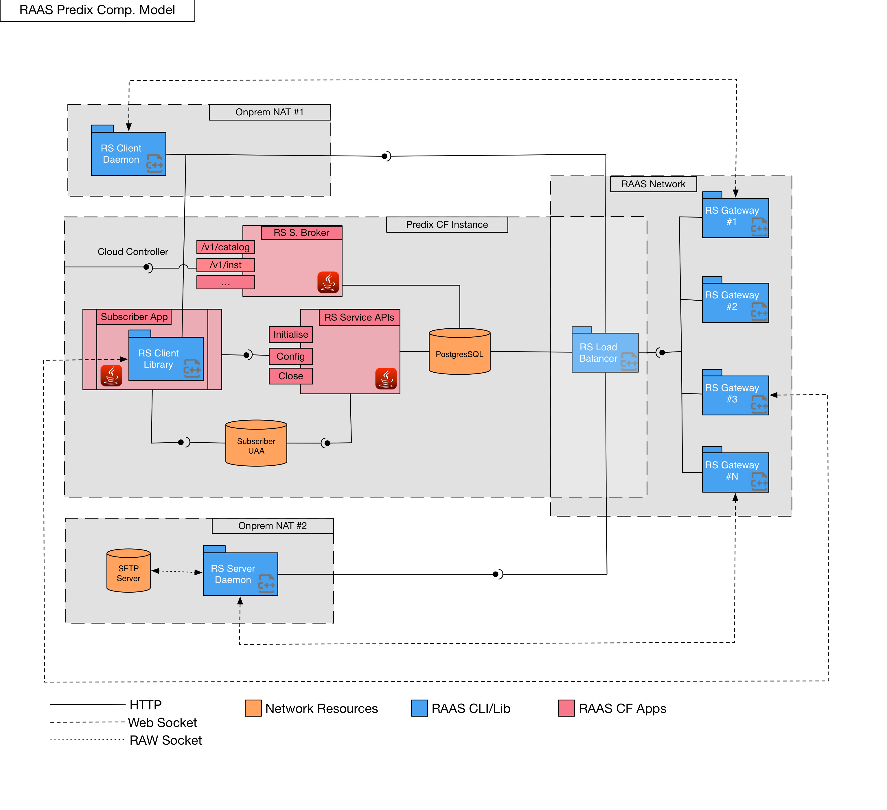
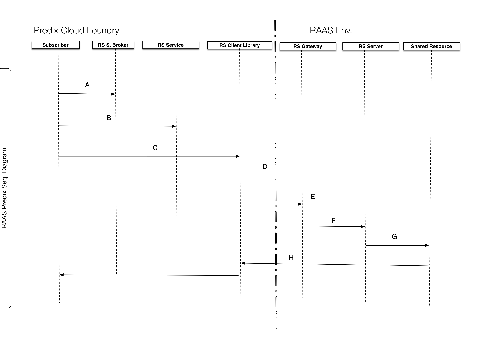

# rs-predix-service
 - The RAAS Predix/CF Service.
 
 
###Predix Composite Model


###Predix Sequence Diagram


##Creating a RAAS Gateway Service Instance
> Note: The following steps are performed using the Cloud Foundry CLI. To complete the steps in a web browser, follow the instructions on the service page in the Predix Catalog.

####Use the Cloud Foundry CLI to log into Cloud Foundry.
```
cf login -a <API_Endpoint>
```

The value of <API_Endpoint> is available in the Predix Invitation email that you get when you sign-up to Predix.io. Depending on your Predix.io registration, the value of <API_Endpoint> is one of the following:

Predix Basic
https://api.system.aws-usw02-pr.ice.predix.io

Predix Select
https://api.system.asv-pr.ice.predix.io

####List the services in the Cloud Foundry marketplace by entering:
```
cf marketplace
```
You see the available services and associated plans.

Create a RAAS Gateway Service instance by entering:
```
cf create-service predix-blobstore <plan> <my_blobstore_instance> 
```

Use only alphanumeric characters, underscores (_), and hyphens (-) for your service instance name.
Where:
<plan> – the plan associated with the service.
<my_blobstore_instance> – the service instance you create.
Binding an Application to a Blobstore Service Instance
You can use any S3-compatible client to connect to your Blobstore to store and retrieve objects. Before binding an application to a Blobstore service instance, you must push your application to Cloud Foundry. From your application's project directory, on a command line, enter:
cf push <application_name>
You must bind your Blobstore service instance to your application to provision connection details for your service instance in the VCAP environment variables. Cloud Foundry runtime uses VCAP_SERVICES environment variables to communicate with a deployed application about its environment.

Use the Cloud Foundry CLI to log into Cloud Foundry.
cf login
Bind your application to the service instance you created.
cf bind-service <application_name> <my_blobstore_instance>
Restage your application to ensure the environment variable changes take effect:
cf restage <application_name>
To view the environment variables for your application, enter:
cf env <application_name>
The command shows the environment variables, which contain your basic authorization credentials, client ID, and the endpoint URI, as shown in the following example:
"VCAP_SERVICES": {
  "predix-blobstore": [
   {
    "credentials": {
     "access_key_id": "<access_key>",
     "bucket_name": “bucket-<instanceID>",
     "host": "<host_name>",
     "secret_access_key": “<secret_access_key_value>",
     "url": "https://<blob_store_url>"
    },
    "label": "predix-blobstore",
    "name": "<blob_store_service_instance>",
    "plan": "<plan>",
    "provider": null,
    "syslog_drain_url": null,
    "tags": [
     "blobstore",
     "blob-store",
     "blob store"
    ]
   }
  ]
 }
}

